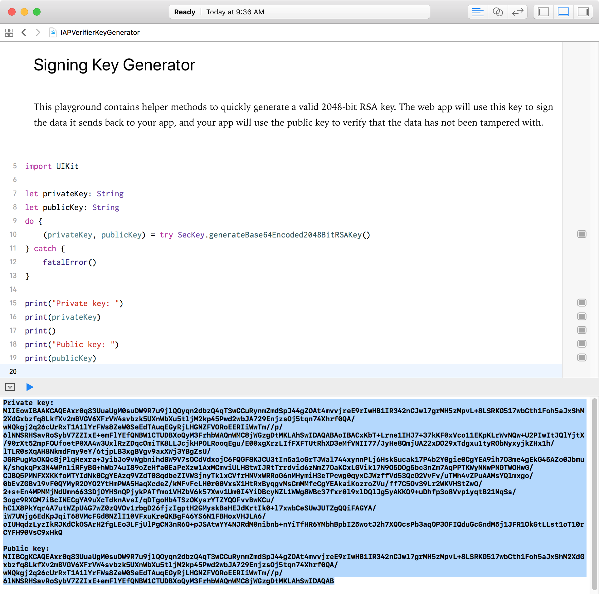

[](https://heroku.com/deploy)

# In-App Purchase Receipt Verifier

A simple, one-click deploy web app to simplify [the process of validating In-App Purchase receipts on the App Store](https://developer.apple.com/library/content/releasenotes/General/ValidateAppStoreReceipt/Chapters/ValidateRemotely.html#//apple_ref/doc/uid/TP40010573-CH104-SW1). Written using Django 1.11 and Python 3.6.2.

## Usage

### Deployment

1. (Optional, but highly recommended) Download [IAPVerifierKeyGenerator.playground](IAPVerifierKeyGenerator.playground) and run the playground. Copy the highlighted Base-64 encoded values below. Save these values for the next steps.

   

2. Create the project on [Heroku](https://heroku.com) using the Deploy Button above. Before you do, make sure that you've already obtained your app-specific shared secret for authentication from iTunes Connect. For the `BASE64_ENCODED_SIGNING_KEY` value, paste in the value for the private key from Step 1.

### In Your iOS App

1. Add `IAPReceiptVerifier` to your Podfile, then run `pod update`.

2. Use something like the following in your iOS app to validate your receipts.

    ```swift
    guard let verifier = IAPReceiptVerifier(base64EncodedPublicKey: _publicKey),
        let receiptURL = Bundle.main.appStoreReceiptURL,
        let data = try? Data(contentsOf: receiptURL) else {
            return
    }

    let encodedData = data.base64EncodedData(options: [])
    let url = URL(string: "https://your-app.herokuapp.com/verify")!

    var request = URLRequest(url: url)
    request.httpBody = encodedData
    request.httpMethod = "POST"

    let task = URLSession.shared.dataTask(with: request) { (data, response, error) in
        guard let data = data,
            let HTTPResponse = response as? HTTPURLResponse,
            let object = try? JSONSerialization.jsonObject(with: data, options: []),
            let json = object as? [String: Any],
            let signatureString = HTTPResponse.allHeaderFields["X-Signature"] as? NSString,
            let signatureData = signatureString.data(using: String.Encoding.utf8.rawValue),
            verifier.verify(data: data, signature: signatureData) else {
                return
        }

        // Your application logic here.
    }
    task.resume()
    ```

## Local Testing

```
curl -X POST -T receipt https://your-app.herokuapp.com/verify
```

...where `receipt` is a file with base-64 encoded receipt data.

## License

In-App Purchase Receipt Verifier is available under the Apache 2.0 license. See the [LICENSE](LICENSE) file for more info.

